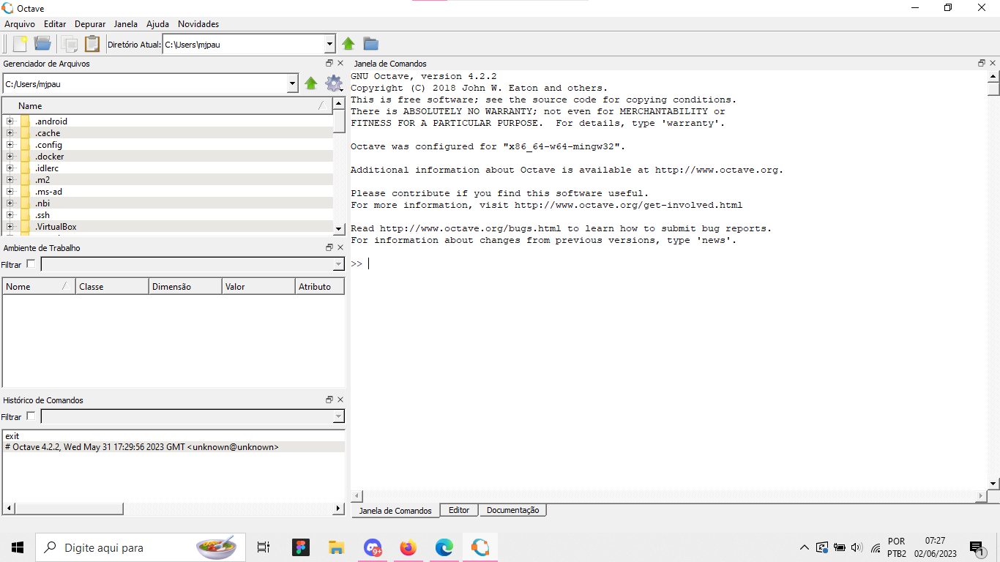
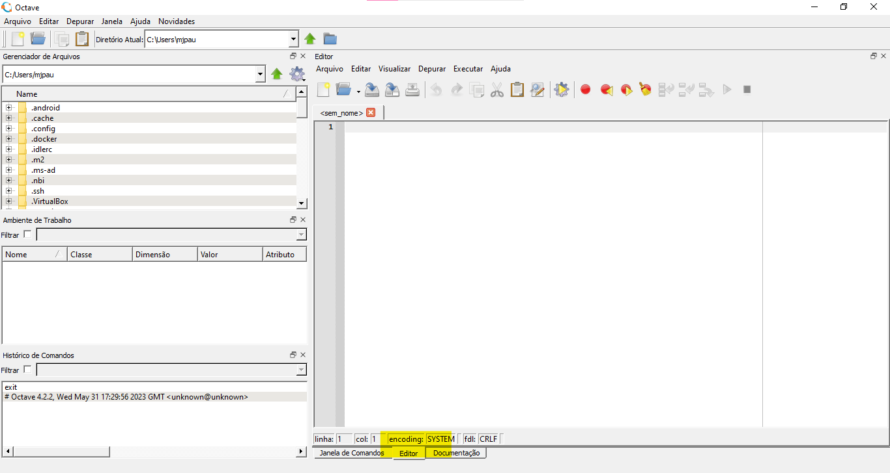
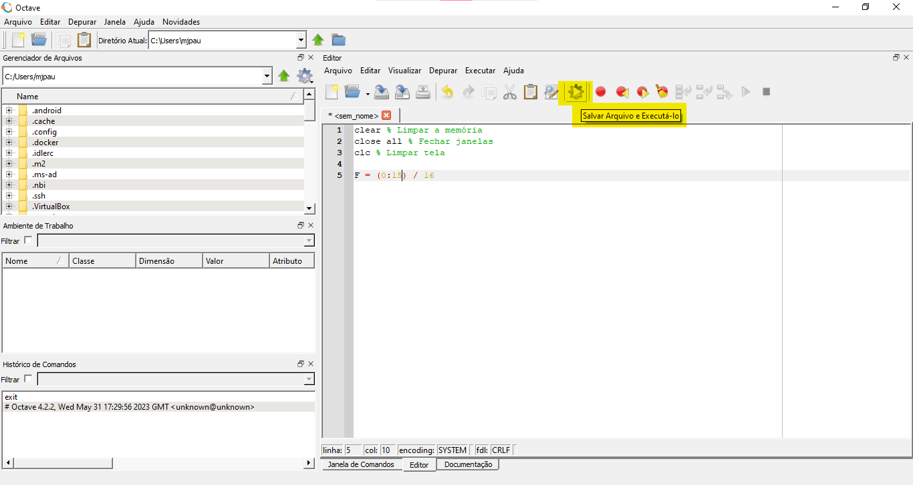
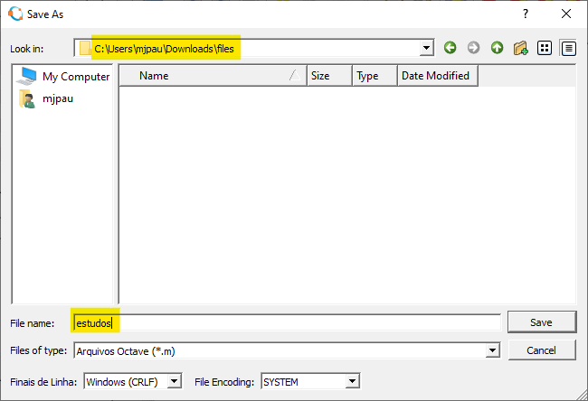
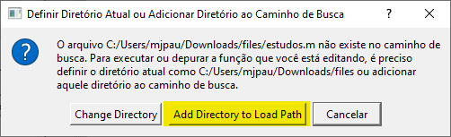
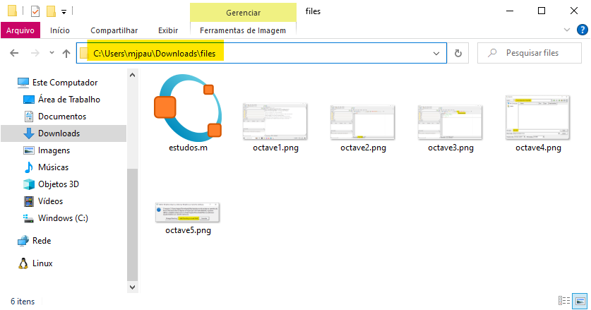
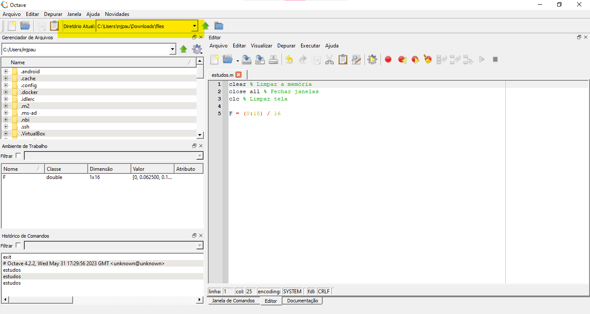
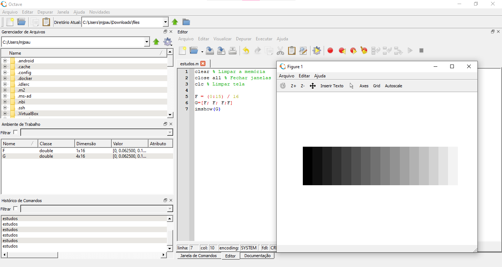

# Tutorial para configurar e rodar os primeiros comandos no Octave

Esse tutorial é do `Octave 4.2.2` no Windows 10. Baixamos o arquivo `octave-4.2.2-w64-installer.exe` nesse [link](https://mirror.us-midwest-1.nexcess.net/gnu/octave/windows/).
Se precisar de ajuda para instalar o Octave, siga esse tutorial, da Bóson Treinamentos: [tutorial Bóson Treinamentos](http://www.bosontreinamentos.com.br/octave/como-instalar-o-gnu-octave-no-microsoft-windows-10/).

## Primeiros passos após a instação

Essa é a primeira visão que você terá quando abrir o Octave.



Para escrever o seu primeiro arquivo, vá para a seção "Editor" no inferior da janela, conforme ilustrado



Após escrever algum código do Octave, salve o arquivo e execute-o. 



Escolha a pasta na qual o arquivo será salvo. No meu caso, criei uma pasta chamada `files` em `Downloads` e decidi salvar o meu arquivo do Octave nela, mas essa escolha ficará a seu critério. Também escolha um nome para o seu novo arquivo.



Se você escolheu uma pasta diferente da pasta do seu usuário no Windows, será necessário definir a pasta que você escolheu como o diretório atual ou adiciona-lá ao diretório de busca. Para isso, se a tela com o aviso "Definir Diretório Atual ou Adicionar Diretório ao Caminho de Busca" aparecer, aperte `Add Directory to  Load Path`.



Além disso, também é necessário mudar seu `Diretório Atual`. Para isso, copie o caminho completo da sua pasta onde o arquivo .m está salvo. 



E cole essa informação no campo de Diretório Atual no Octave.



Assim, é possível rodar seu código com sucesso. Dependendo do comando, uma nova janela será aberta com a imagem.



Também é possível ver o resultado pela Janela de Comandos.

## Perguntas Frequentes

### Salvei o Arquivo e o executei, mas nada aconteceu. 
Certifique-se que seu código tem algum comando ou função que mostre uma imagem ou alguma informação na Janela de Comandos. Se o seu código for esse:
    
```
clear % Limpar a memória
close all % Fechar janelas
clc % Limpar tela 
```
    
Realmente nenhuma janela será aberta, já que não há comando para isso.

Também confira se você importou as bibliotecas necessárias para mostrar imagem, com `pkg load image`.
